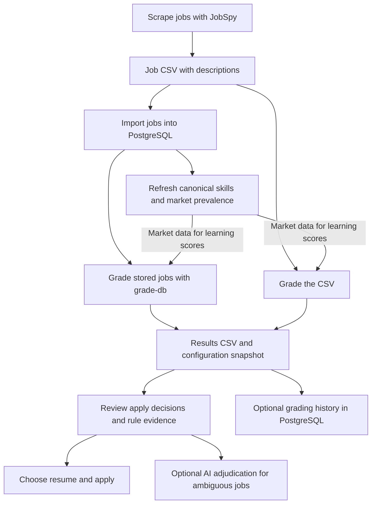

# SkillFreq workflow: from scraped jobs to results

Use this guide for the daily workflow. For the scoring rules and implementation,
see [deterministic grading](deterministic-grading.md).
For a browsable list of commands and options, use the [command reference](commands.md).



**The shortest path is scrape → CSV → grade → review.** PostgreSQL adds market
prevalence and persistent history. AI is optional and does not run automatically.

## Start with jobs already in PostgreSQL

Choose **Terminal → Run Task → Grade DB Jobs - Last 90 Days** in VS Code.
It reads deduplicated titles and descriptions from `public.clean_jobs`, grades them
with your current profile and rules, and exports `data/outputs/results-db-90-days.csv`
plus its `.grading.yml` snapshot. Open the CSV to review lanes, fit, learning,
confidence, apply decisions and full evidence in `grade_json`.

The window uses posting date. No input CSV or new scrape is needed. The DB view
does not expose search-lane metadata, so the grader leaves that context blank and
evaluates the actual posting. Existing market prevalence supplies learning context
when available; this task does not refresh prevalence or save grading history by
default. See [DB grading options](commands.md#grade-jobs-from-postgresql).

## 1. Prepare your environment

Run SkillFreq commands from the SkillFreq repository root. These examples use
PowerShell and assume the separate JobSpy repository is next to SkillFreq.

For an existing installation:

```powershell
.\.venv-skillfreq\Scripts\Activate.ps1
python -m skillfreq.cli --help
```

For a new Python environment:

```powershell
python -m venv .venv-skillfreq
.\.venv-skillfreq\Scripts\Activate.ps1
python -m pip install --upgrade pip
python -m pip install -r requirements.txt
```

If you will scrape job pages through SkillFreq, install its browser dependency:

```powershell
python -m playwright install chromium
```

JobSpy scraping uses your JobSpy installation/environment. It is a separate step
from grading with SkillFreq.

Before grading, check [profile.yml](../configs/profile.yml): it describes your
current capabilities, any explicit atomic skill strengths, and growth priorities.
You do not need PostgreSQL to grade an existing CSV offline.

## 2. Scrape jobs and keep the CSV

Use your normal JobSpy scraper for the day's search. In the existing sibling
JobSpy repository, this small test command retrieves one job:

```powershell
Push-Location ..\JobSpy
python scrape_one_job.py --term "data engineer" --location "Texas"
.\move_to_import.ps1 -Execute
Pop-Location
```

The test scraper writes `jobs-M-D-YY.csv`. The move helper moves matching dated
CSVs into the sibling repository's `import` folder; it can move more than the one
new file. Run it without `-Execute` to preview the moves. These two scripts belong
to the sibling JobSpy repository, not the SkillFreq CLI.

SkillFreq also contains [Jobspy/joblist.py](../Jobspy/joblist.py), a scraper helper
with search terms and lane metadata. It writes its dated CSV in the directory
from which it runs. Use the output of whichever scraper you already maintain.

Useful CSV columns are:

| Column | Purpose |
|---|---|
| `title`, `description` | The actual job content used for grading |
| `id`, `site`, `job_url` | Source identity and a link back to the posting |
| `company`, `date_posted`, `location` | Context for review and database analysis |
| `search_lane`, `search_term_used`, `review_priority` | Optional search context |

Keep descriptions when scraping. A URL alone is not enough for `grade-csv`; use
the [URL workflow below](#alternative-start-with-job-links) if descriptions are missing.
The final `role_lane` is determined from job content, not copied from `search_lane`.

The older `Jobspy/cleanJoblist.py` helper can filter a dated CSV into
`cleaned_jobs-M-D-YY.csv`, but it is not required before grading. Its own buckets
are separate from SkillFreq's final decisions. For broad market prevalence, use
the job population you intend to measure rather than automatically discarding
everything outside the target lane.

## 3. Grade the CSV directly

Set these paths to your actual files. The date below is only an example.

```powershell
$jobsCsv = "..\JobSpy\import\jobs-9-12-26.csv"
$resultsCsv = "data\outputs\results-9-12-26.csv"

python -m skillfreq.cli grade-csv `
  --input $jobsCsv `
  --out $resultsCsv `
  --offline-grading
```

This extracts atomic technologies and broader capabilities, checks requirements,
scores role evidence, and produces fit, learning, confidence and apply decisions.
It does not scrape pages or call AI. It grades the rows supplied; it does not
automatically substitute PostgreSQL's deduplicated job population.

You receive two files:

| Output | What to do with it |
|---|---|
| `results-9-12-26.csv` | Open it in Excel or your usual CSV viewer to review jobs |
| `results-9-12-26.grading.yml` | Keep it with the CSV; it records the exact configuration used |

Offline grading has no prevalence input, so learning is null/unavailable
and includes an explicit reason. To get market-backed learning values,
complete step 4 and grade again without `--offline-grading`.

## 4. Add PostgreSQL market data

Skip this step if you only want an offline fit assessment. Otherwise, refresh
market data before generating your final results.

### Connect and import

Use the existing SkillFreq PostgreSQL installation. Connection settings come from
`.env`: either `DATABASE_URL`, or `DB_NAME`, `DB_USER`, `DB_PASSWORD`, `DB_HOST`
and optional `DB_PORT`.

```powershell
python -m skillfreq.cli excel-load `
  --folder ..\JobSpy\import `
  --table staging.jobs `
  --mode append `
  --log-file logging/excel_to_db_log/jobs_folder_load.log
```

This imports every CSV beneath the folder, including subfolders, and records the
source filename. Move successfully imported files outside that intake tree before
the next append run to avoid importing them again. Keep the selected CSV available
at `$jobsCsv` for grading, or update that variable if you move it.

`public.clean_jobs` normalizes and deduplicates `staging.jobs` for market analysis.
It retains postings with a title, company and description. The view definition
is in [db/views/clean_jobs.sql](../db/views/clean_jobs.sql). The loader does not
create this view; a fresh database needs that existing schema setup first.

### Refresh canonical skills and prevalence

```powershell
python -m skillfreq.cli refresh-job-skills
```

This reads `public.clean_jobs`, extracts the atomic technologies in
`market_skills.yml`, and updates the existing market tables and views. It also
creates/populates `job_skill_scope` on installations missing that schema evolution.

For a smaller, explicitly chosen population:

```powershell
python -m skillfreq.cli refresh-job-skills --since-days 90 --limit 1000
```

Each successful refresh replaces the current extraction scope. Prevalence is
**jobs mentioning a canonical skill / all jobs in that same scope**, including
jobs with no skill matches. A failed refresh leaves the previous successful
snapshot intact. Percentages overlap and should not be added together.

Query the results through your PostgreSQL client:

```sql
SELECT canonical_skill, jobs_mentioning_skill, total_jobs, prevalence_pct
FROM public.skill_prevalence
ORDER BY prevalence_pct DESC;
```

For a filtered dashboard, use `public.job_skill_prevalence_input`: filter the
population first, then aggregate its `mentions_skill` values by canonical skill.

### Grade with the refreshed market data

```powershell
python -m skillfreq.cli grade-csv --input $jobsCsv --out $resultsCsv
```

This reads the existing prevalence view. Learning points require a missing/weak
skill, an appropriate role lane, adjacent profile experience and a configured
growth path. A required technology can reduce fit while increasing learning value.
Unavailable market data is reported explicitly; grading can still complete.

## 5. Read the results and decide what to review

Start with `apply_decision`, then check `role_lane`, `fit_quality`, the scores and
their evidence. A high numeric score alone is not an instruction to apply.

| Field | Meaning |
|---|---|
| `apply_decision` | `apply_now`, `manual_review` or `skip` |
| `role_lane` | `target_lane`, `secondary_lane`, `bridge_lane`, `survival_lane` or `wrong_lane` |
| `fit_quality` | `good_fit`, `possible_fit` or `weak_fit` under the conservative decision policy |
| `fit_score` | Current-profile fit on a 0–100 scale |
| `learning_score` | Market-informed value of relevant growth skills, on a 0–100 scale |
| `confidence` | Explainable heuristic confidence, not a calibrated probability |
| `ai_review_required` | Whether ambiguity warrants adjudication; it does not invoke AI |
| `reason_codes` | Reasons and decision rules behind the result |
| `grade_json` | Full atomic/capability matches, gaps, lane scores, penalties and explanations |
| `grading_version`, `taxonomy_version` | Which grading configuration/implementation and market taxonomy were used |
| `score`, `raw_match` | Preserved legacy alignment score and threshold label |

`pre_ai_score` currently equals `fit_score`. The legacy `required_total` counts
detected scoring channels; use the typed requirement gaps inside `grade_json` for
actual required/preferred missing skills.

For each promising posting, inspect required gaps, seniority and any exclusion
signals. Review ambiguous jobs yourself or pass their evidence to your existing AI
review process. SkillFreq does not automatically submit applications or make AI calls.
See [example grades](grading-examples.yml) for complete evidence records.

To inspect why a result landed in its lane, generate a trace for its `id`:

```powershell
python -m skillfreq.cli trace-job --input $resultsCsv --id <job-id> --out docs/generated/job-trace.md
```

The trace uses the same evaluator events as grading and shows rule inputs,
state changes, final owners and any rules stopped by an earlier decision. For a
configuration-wide view, run `policy-report`; use `policy-impact --rule <id>`
when considering a policy edit. These reports are observational and do not alter
career policy.

## 6. Save grading history when useful

To grade and append an audit record directly:

```powershell
python -m skillfreq.cli grade-csv `
  --input $jobsCsv `
  --out $resultsCsv `
  --persist-grades
```

This evolves the existing `skill_scores` table using `db/grading.sql`, stores the
configuration snapshot, and makes grades queryable through `job_grade_history`.
It requires the existing base `skill_scores` table. It does not import source jobs
into `staging.jobs` or refresh market prevalence. Repeating it appends another grade.

Alternatively, use the existing batch importer for source jobs, results and an
optional review workbook. If this is your chosen persistence route, omit
`--persist-grades` above to avoid saving the same grading run through both routes.

```powershell
python -m skillfreq.cli import-batch `
  --batch-id 2026-09-12 `
  --jobs-csv $jobsCsv `
  --scores-csv $resultsCsv `
  --review-xlsx data/analyze/results-9-12-26-review.xlsx
```

Omit `--review-xlsx` if you have no review workbook. The default review sheet is
`Base`. The importer writes `raw_jobs` and `skill_scores`, plus `calibration_runs`
and `calibration_results` when a review workbook is supplied. These are separate
from the `staging.jobs` market intake. Keep the `.grading.yml` beside a new-format
results CSV so the importer can validate and save its configuration snapshot.

`--batch-mode replace` explicitly clears and reloads that batch's existing records;
the default is append.

## 7. Choose a resume and apply

After reviewing a posting, optional resume routing can suggest an existing variant:

```powershell
$env:NOTION_TRACKER_PATH = (Get-Location).Path
python -m skillfreq.cli route `
  --input $resultsCsv `
  --out data/outputs/routed-results.csv `
  --title-col title `
  --jd-col description
```

The current router requires `NOTION_TRACKER_PATH` as its input base directory. This
example points it at the repository root. It adds a recommended resume and routing
reasons to a CSV; it does not send anything to Notion or rewrite your resume.

You can also inspect resume signals and count recurring titles:

```powershell
python -m skillfreq.cli extract --file data/inputs/resume.pdf
python -m skillfreq.cli titles $resultsCsv --title-col title
```

Resume extraction prints evidence; review it before editing your profile. Make the
final application decision using the posting, blockers and evidence you've reviewed.

## Alternative: start with job links

If you have URLs instead of usable descriptions:

```powershell
python -m skillfreq.cli fetch --input $jobsCsv --output data/inputs/links.txt
python -m skillfreq.cli run `
  --input data/inputs/links.txt `
  --out data/outputs/results-from-links.csv `
  --offline-grading
```

`fetch` attempts to obtain usable links; `run` retrieves and grades their pages.
You can also create `links.txt` yourself with one URL per line. Failed or blocked
fetches are recorded in `data/outputs/failures.csv` when using that output folder.
Omit `--offline-grading` for market data and add `--persist-grades` for history.

The older `run --no-scrape` path reads **today's raw `jobs-M-D-YY.csv`** from
`JOBSPY_DATA_PATH` (default `../JobSpy`). Its required `--input` argument does not
select the CSV in that mode. Use `grade-csv --input ...` when choosing a specific
raw or cleaned CSV yourself.

Add `--nlp-diagnostics` to `run` only if you want supplemental noun-phrase output
in `extracted_skills_*.txt`. Those phrases do not become canonical skills or grades.

## Configuration and troubleshooting

| File | Edit it to change |
|---|---|
| `configs/profile.yml` | Your strengths, explicit technology knowledge and growth paths |
| `configs/market_skills.yml` | Atomic technology names and aliases; refresh market data afterward |
| `configs/skills.yml` | Broader capabilities and their relationships to atomic technologies |
| `configs/roles.yml` | Lane evidence, exclusions and resume routing |
| `configs/requirements.yml` | Requirement headings, blockers and seniority signals |
| `configs/weights.yml` | Weights, penalties, thresholds, fit, learning and confidence settings |
| `configs/resume_signal.yml` | Supplemental resume evidence and domains |

| Symptom | Check |
|---|---|
| Learning is blank/null | Check `market_context` and diagnostics; market data was unavailable. A real zero means no eligible growth contribution |
| Market scope missing or taxonomy mismatch | Run the existing `refresh-job-skills` workflow after verifying database setup and intended scope |
| Refresh cannot find `clean_jobs` | The existing clean-job database view must be installed first |
| Job has little/no evidence | Confirm the CSV actually contains its description |
| Repeated intake rows | Folder append reloads every CSV beneath the intake folder |
| URL fetch failed | Inspect `failures.csv` and `logging/skillfreq_log_*.log` |
| Unexpected lane or apply decision | Inspect matched rules, penalties, gaps and confidence in `grade_json` |

The CLI's global DB timeout flags configure the existing import/refresh commands;
put them before the command name. For example:

```powershell
python -m skillfreq.cli --db-statement-timeout 180 refresh-job-skills
```

The grading market/history helpers currently use their own bounded waits. See
`python -m skillfreq.cli <command> --help` for each command's available options.

## Optional Docker run

Local Python is the main workflow. To try offline CSV grading in the existing image:

```powershell
docker build -t skillfreq .
docker run --rm `
  -v "${PWD}/data:/app/data" `
  -v "${PWD}/configs:/app/configs" `
  -v "${PWD}/logging:/app/logging" `
  skillfreq grade-csv --input data/inputs/jobs.csv --out data/outputs/results.csv --offline-grading
```

Place the chosen CSV in `data/inputs/jobs.csv` first. The bind mounts keep outputs
and logs after the container exits. The current Dockerfile does not include the
`db` directory, so use the local workflow for database migrations and persistence.
